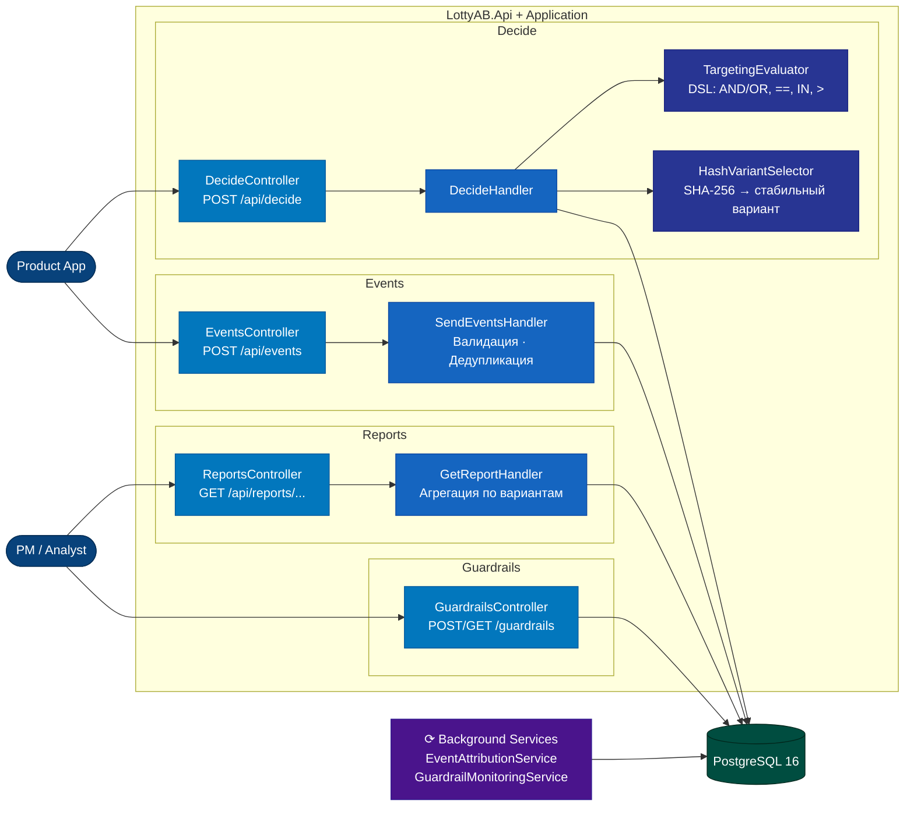

# C4 Component — критичный путь (Level 3)

Компоненты `LottyAB.Api + Application` на пути **decide → event → report / guardrail**.

## Критичный путь

| Путь | Ключевые компоненты |
|---|---|
| **decide** | DecideController → DecideHandler → TargetingEvaluator + HashVariantSelector → Decision в БД |
| **event** | EventsController → SendEventsHandler → валидация + дедуп → Events в БД |
| **attribution** | EventAttributionService (30 сек) → связывает Events с Decisions по DecisionId |
| **report** | ReportsController → GetReportHandler → агрегация Events по Variant |
| **guardrail** | GuardrailMonitoringService (60 сек) → пересчёт метрик → Pause / Rollback + TriggerHistory |
