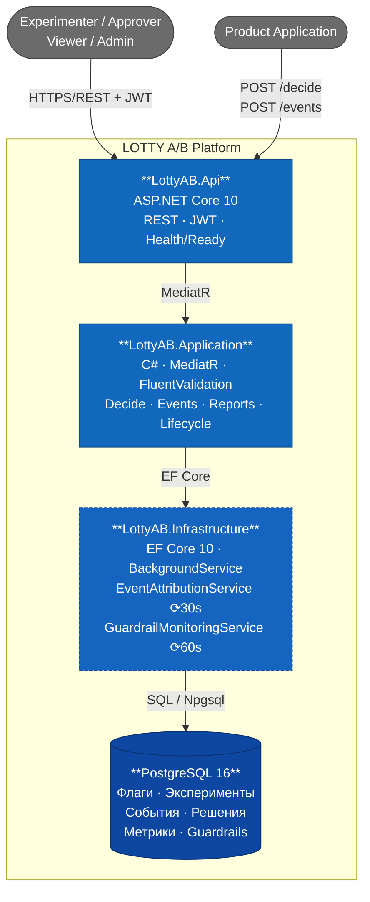

# C4 Container — LOTTY A/B Platform (Level 2)

Контейнеры системы, их ответственности и взаимодействия.

| Контейнер | Технология | Ответственность |
|---|---|---|
| **LottyAB.Api** | ASP.NET Core 10 | REST-эндпоинты, JWT-аутентификация, ролевая авторизация, health/ready |
| **LottyAB.Application** | C#, MediatR, FluentValidation | CQRS-обработчики, бизнес-сервисы (TargetingEvaluator, HashVariantSelector) |
| **LottyAB.Infrastructure** | EF Core 10, BackgroundService | Persistence + два фоновых воркера |
| **PostgreSQL 16** | СУБД | Единое хранилище всех данных платформы |
