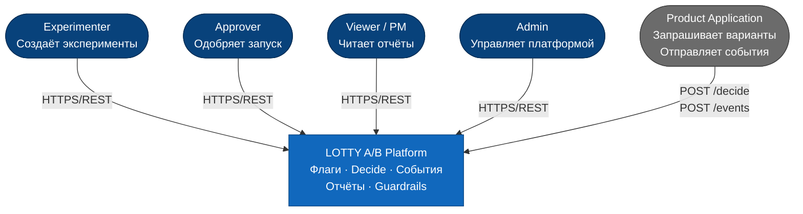

# C4 Context — LOTTY A/B Platform

Внешние акторы и граница системы.

| Актор | Роль |
|---|---|
| **Experimenter** | Создаёт флаги и эксперименты, отправляет на ревью |
| **Approver** | Ревьюит эксперименты, одобряет / отклоняет запуск |
| **Viewer / PM** | Читает отчёты, принимает решение о раскатке / откате |
| **Admin** | Управляет пользователями, аппрувер-группами, каталогами |
| **Product Application** | Запрашивает значения флагов, отправляет события |
